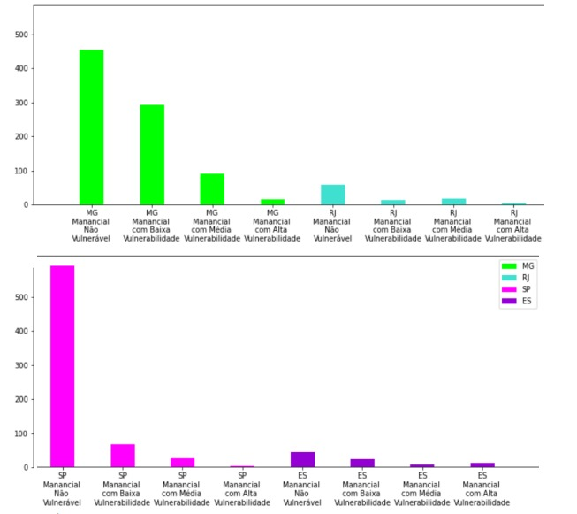

# AnaliseSegurançaHidrografica
Analise de arquivo CSV em python

ANÁLISE DE DADOS EM PYTHON: SEGURANÇA HÍDRICA NO
SUDESTE BRASILEIRO

  

Felipe Parreiras - felipeparreiras86@gmail.com | 
Felipe Werneck - felipwerneck@gmail.com

 

CEFET - MG / Divinópolis

 

# Resumo
&nbsp; O artigo procura analisar o índice de segurança hídrica na região sudeste, partindo do
princípio de que a água é um recurso indispensável, sendo utilizada desde o uso doméstico
até o comercial. Foram analisados os resultados de uma pesquisa governamental (IBGE)
acerca do nível de segurança hídrica em todo o Brasil. A citada análise foi feita em um
sistema utilizando a linguagem de programação python, devido à sua ampla praticidade na
ciência de dados.
Palavras-chave: Python, Segurança Hídrica, Data Mining, Sudeste, Municípios.
# Objetivos
  - Geral: Analisar os dados, utilizando dos conceitos de mineração de dados, buscando
exibir de maneira prática e rápida, as informações contidas na pesquisa sobre
segurança hídrica do IBGE (Instituto Brasileiro de Geografia e Estatística).
  - Específico: Durante o ano de 2021 foram feitas pesquisas acerca da segurança hídrica
urbana por todo o Brasil pelo IBGE. Por ter sido feita em todos os municípios
brasileiros, a pesquisa é extremamente extensa e necessita de meios computacionais
para efetuar a análise dos resultados. Portanto, a linguagem de programação “python”
foi utilizada.

# Introdução
&nbsp; Por meio da ciência de dados, neste trabalho, é realizado um levantamento referente a
segurança hídrica urbana na região sudeste do Brasil, buscando relacionar os sistemas de
mananciais com suas respectivas características, e analisar como isso afeta a segurança
hídrica. Atualmente, é nítida a importância da segurança dos recursos hídricos, e ter
conhecimento sobre como está cada região é de suma importância. A região sudeste foi
selecionada, pelo fato de que esta realiza uma importante dispersão das águas fluviais, tem
forte produção elétrica através das hidrelétricas, e utiliza dos recursos hídricos para a
agricultura.

&nbsp; Apresentando cerca de 6% dos mananciais do Brasil, seria de difícil realização o
levantamento de dados referentes à segurança hídrica urbana na região sudeste, sem a
utilização de python e mineração de dados. Utilizamos, neste trabalho, o recurso big data,
onde extraímos os dados e aplicamos significados a estes dados, buscando padrões,
discrepâncias, e relações, para tornar possível o estudo do mesmo, possibilitando tomadas de
decisão mais concisas, já que o relacionamento de uma grande quantidade de dados apresenta
informações fundamentais, não só na segurança hídrica urbana citada neste trabalho, mas sim
em qualquer outra área.

&nbsp; Além disso, o processo conhecido como “Data Mining” foi utilizado na obtenção e na
transformação do extenso número de informações contidas na pesquisa base do IBGE em
gráficos, para facilitar a visualização da mesma. Em trabalhos como esse, o “Data Mining” é
extremamente recomendado e utilizado, pois é humanamente impossível de se analisar
individualmente cada informação. Dessa forma, tal processo utiliza de meios como
agrupamentos, hipóteses, regras, árvores de decisão, grafos, ou dendrogramas para filtrar a
informação e apresentá-la de forma mais simples e prática.

# Metodologia
&nbsp; Neste projeto utilizamos algumas ferramentas para facilitar o processo de mineração
de dados. A linguagem de programação utilizada foi PYTHON, já que esta é uma linguagem
multi-paradigma e de alto nível, tendo como uma das suas principais funções a praticidade,
principalmente na área de ciência de dados.

&nbsp; Aplicamos a programação no ambiente virtual Google COLAB, que utiliza o conceito
de “jupyter notebook”, buscando o desenvolvimento de softwares em código aberto.
Usamos as seguintes bibliotecas: "matplotlib.pyplot", utilizada para a plotagem dos
gráficos, “panda”, utilizada para a manipulação e análise dos dados, “os” e “csv”, que torna
possível a manipulação de arquivos no formato csv.

&nbsp; A base de dados pública utilizada neste projeto, foi referente a segurança hídrica
urbana, retirada do site do IBGE, organização responsável pelo gerenciamento de dados
estatísticos no Brasil.

# Análise de Resultados
- Análise dos Gráficos:

- É visível que, em todo território do sudeste, a quantidade de sistemas isolados é maior
do que a de sistemas integrados. Principalmente no estado de Minas Gerais e São Paulo.

  

- Pode-se observar que, nas regiões de Minas Gerais e São Paulo, os mananciais sem
vulnerabilidade, ou com baixa vulnerabilidade, se destacam, o que ajuda a explicar o bom
índice de segurança hídrica nas regiões. Já as regiões de Espírito Santo e Rio de Janeiro,
apresentam valores aproximados, explicando as dificuldades nessas regiões.

- É notável que as companhias são em sua maioria privadas, ou de autarquia municipal.
Exceto no estado do Rio, onde as Concessionárias Privadas ultrapassam as autarquias
municipais.

- Pode-se inferir que, em cada estado da região Sudeste, predomina uma classificação
diferente de manancial. Sendo este predomínio, em MG; Exclusivamente Superficial, SP;
Exclusivamente Subterrânea, ES; Exclusivamente Superficial e em RJ; Exclusivamente
Superficial. Esta variação de classificação, surge das diferentes características que
apresentam.

&nbsp; Como visto no mapa da região sudeste, é nítido o destaque mínimo apresentado nas
capitais de toda região.
&nbsp; O estado de São Paulo apresenta o maior grau de segurança hídrica, muito devido à
reutilização da água captada da chuva, intenso uso subterrâneo da água e o bom tratamento de
esgoto urbano. Já o estado do Rio de Janeiro, apresenta o menor grau de segurança hídrica,
devido a má gestão dos mananciais e bacias hidrográficas. Diante disso é importante ressaltar
que:

"[...] há uma evidente degradação ambiental nos mananciais utilizados para abastecimento
público da região metropolitana do Rio, o que compromete a qualidade da água, dificulta o
tratamento e pode colocar em risco a saúde pública".(REDAÇÃO, REVISTA VEJA, 2020).

 

&nbsp; O estado de Minas Gerais, devido a sua grande ocupação territorial, apresenta uma
leve discrepância entre sua região norte e sul, onde a região norte tende a ter um grau de
segurança hídrica menor, enquanto a região sul tende a ter um grau de segurança hídrica
maior. Tendo no seu território nascentes de rios importantes em cenário nacional, a segurança
hídrica no estado de Minas Gerais deve apresentar altos índices, por isso, apresenta planos
que buscam manter este bom índice, como:
- Plano Estadual de Recursos Hídricos(PERH).
- Plano Diretor de Recursos Hídricos de Bacias Hidrográficas(PDRH).
- Programa Estratégico de Segurança Hídrica e Revitalização de Bacias Hidrográficas
de Minas Gerais(PMSH).
&nbsp; Por fim, o estado de Espírito Santo, apresenta maior regularidade, apresentando um
grau médio de segurança hídrica, apesar de ainda possuir algumas áreas irregulares, porém
não apresentam um risco iminente à população:

"A queda nas vazões dos mananciais e a possibilidade de não ocorrência de chuvas
em volumes suficientes demandam maior atenção do poder público, das companhias de
abastecimento e dos usuários de água.”(AHNERT,AGERH,2021).

 

&nbsp; Os gráficos, apresentados acima, detalham as informações retratadas no mapa,
mostrando o tipo de segurança, os órgãos responsáveis pela segurança local.

# Conclusão
&nbsp; O desenvolvimento do presente estudo, possibilitou uma análise de como a linguagem
de programação “python” foi determinante na análise e filtragem das informações obtidas
pela pesquisa extremamente extensa feita pelo IBGE sobre a situação da segurança hídrica
em todo o Brasil. Para mais, o recorte de análise feito na região sudeste, possibilitou uma
análise mais precisa da região mais importante, economicamente falando, do Brasil, e
permitiu inferir que todas as suas regiões possuem pontos que necessitam uma melhor
atenção na segurança hídrica local.

# Contatos

#### Felipe Parreiras

#### Felipe Werneck

 

